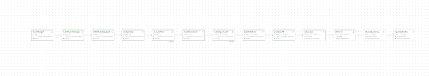

# Travel Booking SCD2 Warehouse Pipeline

## Project Overview

Built an end-to-end Data Engineering pipeline in Databricks using
PySpark, Delta Lake, SQL, and Databricks Workflows.

The project implements a Medallion Architecture (Bronze → Silver → Gold)
with SCD Type 2 customer tracking, data quality validations,
performance optimization, and business analytics reporting.

---

## Architecture

CSV Files
    ↓
Bronze Layer
    ↓
Data Quality Checks
    ↓
Silver Layer (SCD2 + Fact Tables)
    ↓
Optimization (ZORDER + ANALYZE)
    ↓
Gold Analytics Layer
    ↓
Workflow Logging & Monitoring

---

## Technologies Used

- Databricks
- PySpark
- Delta Lake
- SQL
- Unity Catalog
- Databricks Workflows
- Medallion Architecture
- SCD Type 2 (Slowly Changing Dimensions)
- ZORDER Optimization

---

### Project Structure

```text
Travel_Booking_SCD2_Warehouse/
│
├── notebooks/
├── queries/
├── screenshots/
└── README.md

---

## Notebooks

### 00_validate_inputs
Validates source data availability and record counts.

### 01_bronze_customer_ingestion
Loads customer data into Bronze Layer.

### 02_bronze_booking_ingestion
Loads booking data into Bronze Layer.

### 21_dq_customers
Performs customer data quality validations.

### 30_customer_dim_scd2
Implements SCD Type 2 customer dimension logic.

### 31_booking_fact_build
Creates booking fact table.

### 40_optimize_zorder
Optimizes Delta tables using ZORDER.

### 41_analyze_stats
Updates statistics for query optimization.


---

## Catalog Structure


---

## Workflow Pipeline



---

## SQL Analytics

daily_revenue

Daily revenue aggregation.

customer360

Customer-level booking and spending analysis.

data_quality_summary

Data quality reporting.

log_completion_flow

Pipeline completion audit logging.

---

## Medallion Architecture

Bronze
booking_inc
bookings_bronze
customer_inc
customers_bronze
Silver
dim_customers
fact_bookings
Gold
booking_analytics
customer360
daily_revenue
Ops
data_quality_summary
pipeline_log
workflow_run_log


---

## Workflow Orchestration

The entire pipeline is orchestrated using Databricks Workflows.

Execution Order:

00_validate_inputs
↓
01_bronze_customer_ingestion
↓
02_bronze_booking_ingestion
↓
20_dq_bookings
↓
21_dq_customers
↓
30_customer_dim_scd2
↓
31_booking_fact_build
↓
40_optimize_zorder
↓
41_analyze_stats
↓
daily_revenue
↓
customer360
↓
data_quality_summary
↓
log_completion_flow

---

## Key Features

End-to-end Databricks Workflow
SCD Type 2 implementation
Delta Lake storage
Data Quality validation
Medallion Architecture
SQL analytics layer
ZORDER optimization
Automated pipeline logging

---

## Sample Outputs

### Daily Revenue Analytics
- Aggregated booking revenue by date
- Booking count metrics

### Customer360 View
- Customer booking history
- Total spending metrics
- Customer-level analytics
