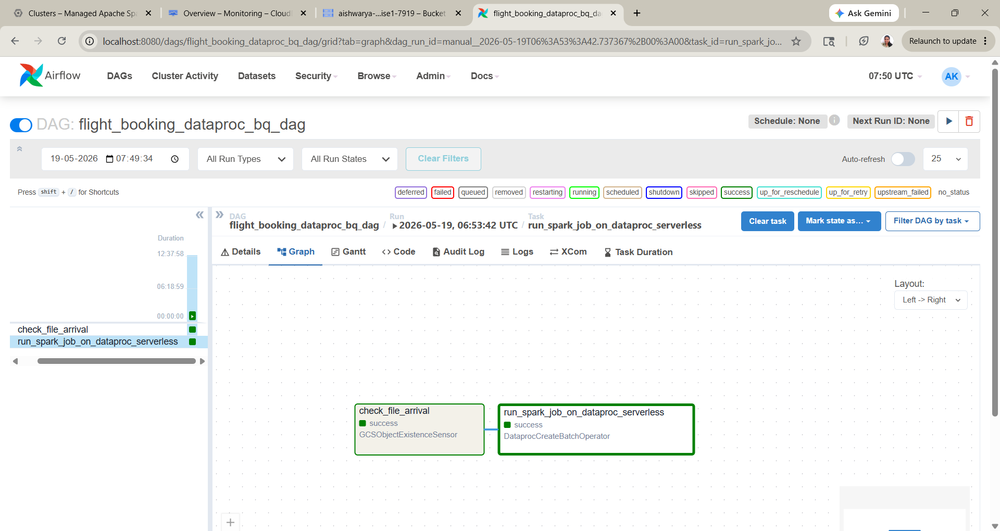
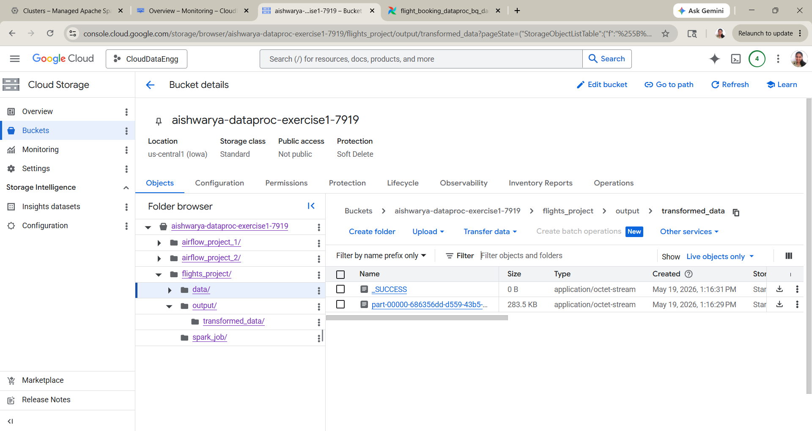
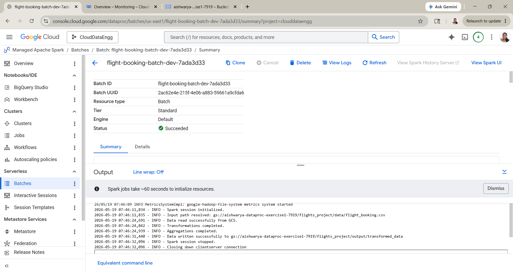

# Flight Booking Analytics Pipeline

## Overview

This project processes flight booking data using Apache Airflow, Dataproc Serverless, PySpark, and Google Cloud Storage.

The pipeline automatically detects incoming flight booking files from GCS and triggers a Spark transformation job using Dataproc Serverless.

---

## Technologies Used

- Apache Airflow
- Google Cloud Platform (GCP)
- Dataproc Serverless
- PySpark
- Google Cloud Storage (GCS)
- Docker

---

## Workflow

1. Detect flight booking file arrival in GCS
2. Trigger Dataproc Serverless batch job
3. Run PySpark transformations
4. Store transformed output back into GCS

---

## Project Structure

flights-project/
│
├── airflow_job/
├── data/
├── spark_job/
├── screenshots/
└── README.md

---

## Screenshots

### Airflow DAG Success

---

### GCS Output Files

---

### Dataproc Batch Success

