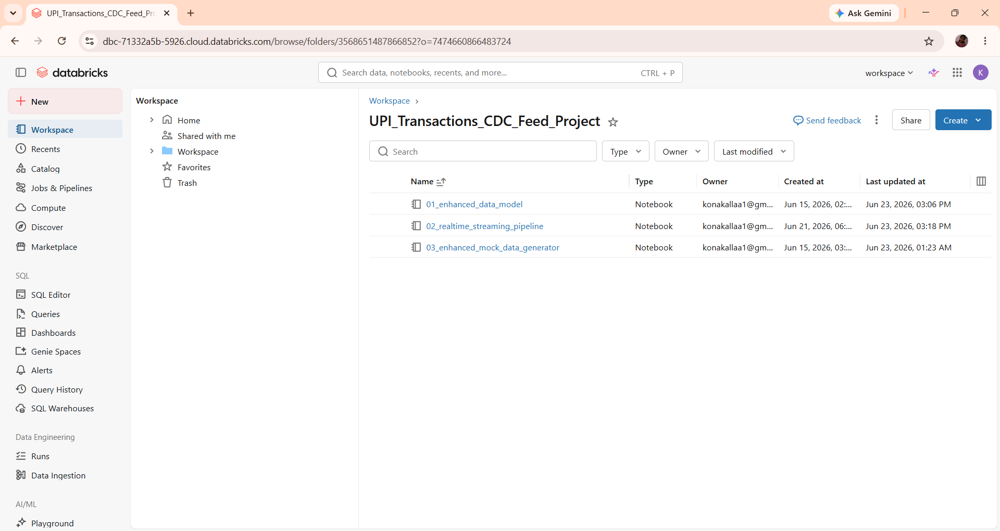
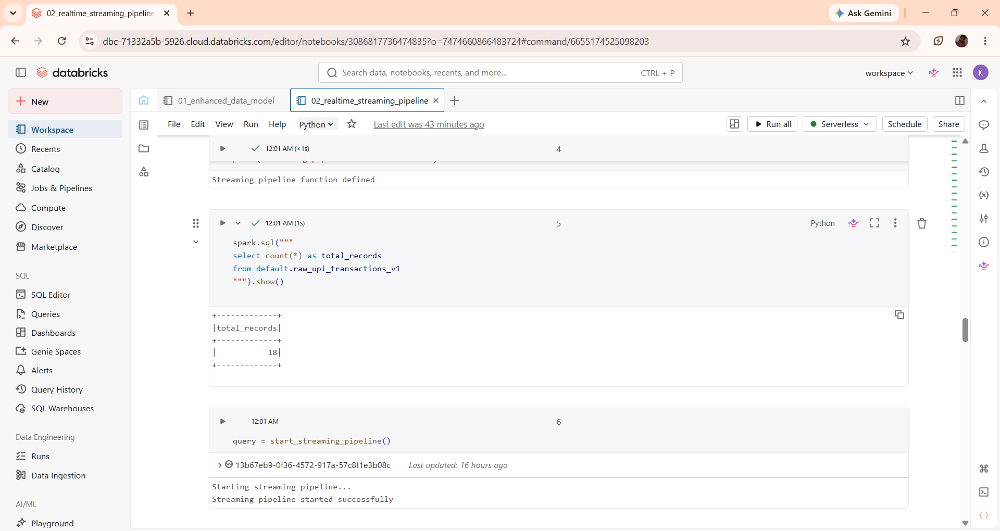
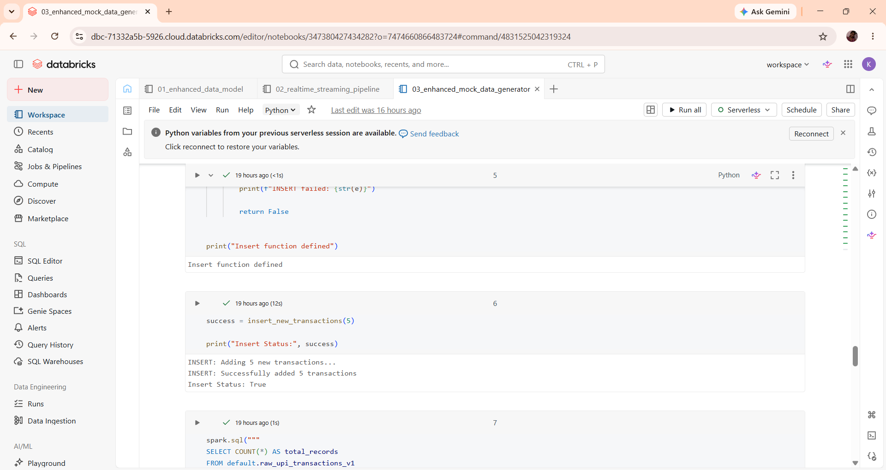
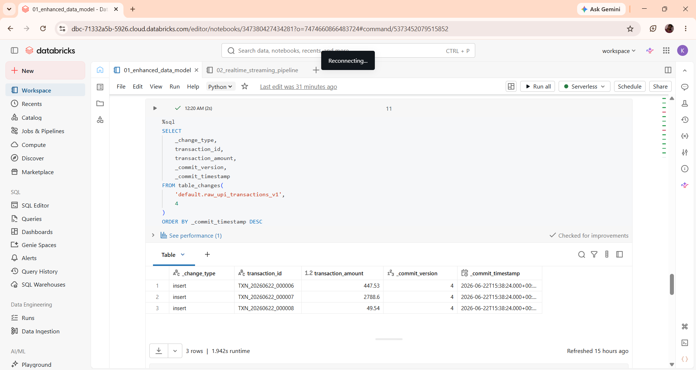
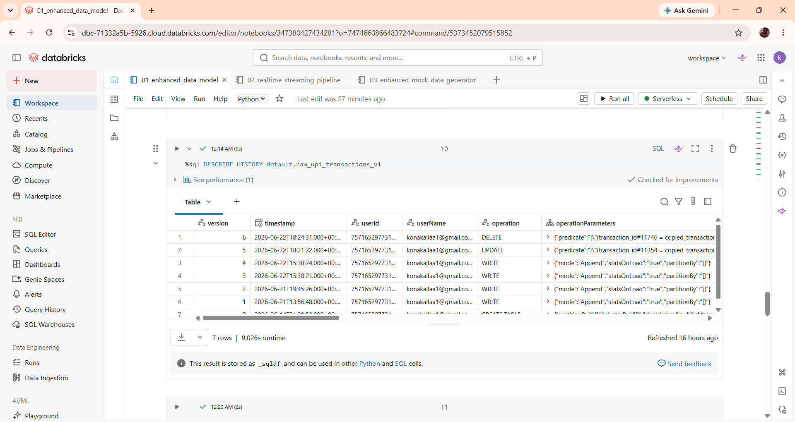
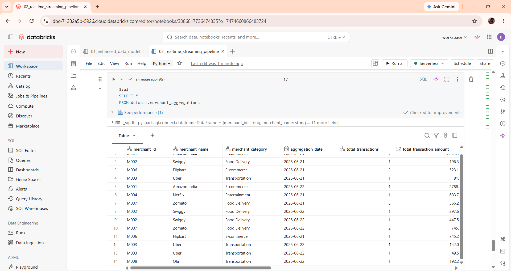
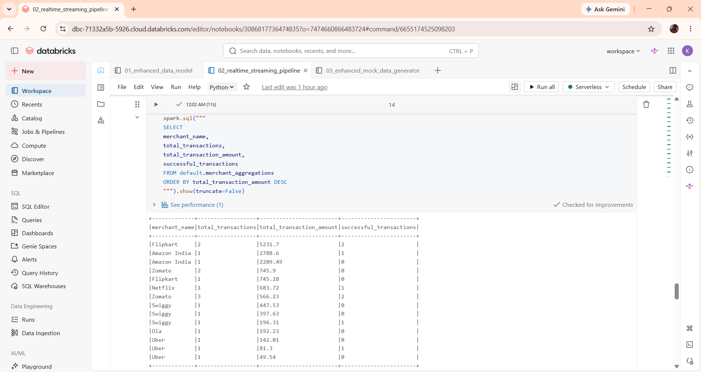

# Real-Time UPI CDC Streaming Pipeline using Databricks

## Project Overview

This project demonstrates a real-time Change Data Capture (CDC) pipeline built using Databricks, Delta Lake, and Structured Streaming.

The system captures changes from a raw UPI transactions Delta table, processes them using Delta Change Data Feed (CDF), and continuously updates merchant-level aggregation tables in near real-time.

The project simulates a real-world fintech payment analytics platform where transaction inserts, updates, and deletes are tracked and reflected in downstream analytical tables.

---

## Architecture

```text
Mock Transaction Generator
            │
            ▼
Raw UPI Transactions Delta Table
            │
            ▼
Delta Change Data Feed (CDF)
            │
            ▼
Structured Streaming
            │
            ▼
foreachBatch Processing
            │
            ▼
Merchant Aggregation Logic
            │
            ▼
Delta MERGE
            │
            ▼
Merchant Analytics Table
```

---

## Technologies Used

- Databricks
- PySpark
- Delta Lake
- Delta Change Data Feed (CDF)
- Structured Streaming
- Delta MERGE
- SQL
- Python

---

## Project Structure

```text
realtime-upi-cdc-pipeline/

├── README.md

├── notebooks/
│   ├── 01_enhanced_data_model.py
│   ├── 02_realtime_streaming_pipeline.py
│   └── 03_enhanced_mock_data_generator.py

├── screenshots/
│   ├── architecture.png
│   ├── streaming_started.png
│   ├── insert_transactions.png
│   ├── delta_history.png
│   ├── cdc_changes.png
│   ├── merchant_aggregations.png
│   └── analytics_query.png
```

---

# Notebook Details

## Notebook 1: Enhanced Data Model

### Responsibilities

- Create raw transaction Delta table
- Enable Change Data Feed (CDF)
- Create merchant aggregation table
- Define table schemas
- Validate Delta history
- Verify CDC records

### Tables Created

#### Raw Transactions Table

```sql
default.raw_upi_transactions_v1
```

#### Merchant Aggregations Table

```sql
default.merchant_aggregations
```

---

## Notebook 2: Real-Time Streaming Pipeline

### Responsibilities

- Read CDC events from Delta Change Feed
- Process incremental transaction changes
- Perform merchant-level aggregations
- Execute Delta MERGE operations
- Continuously update analytical tables

### Main Components

#### Streaming Reader

Reads CDC events from:

```sql
default.raw_upi_transactions_v1
```

#### CDC Processing

Handles:

- INSERT
- UPDATE
- DELETE

events from Delta Change Feed.

#### foreachBatch Processing

Processes each micro-batch independently and updates merchant aggregation tables.

#### Delta MERGE

Performs upserts into:

```sql
default.merchant_aggregations
```

---

## Notebook 3: Enhanced Mock Data Generator

### Responsibilities

Generate realistic UPI transactions.

Supported operations:

### Insert Transactions

```python
insert_new_transactions(5)
```

### Update Transactions

```python
update_random_transactions(2)
```

### Delete Transactions

```python
delete_random_transactions(1)
```

---

# CDC Implementation

Delta Change Data Feed is enabled on the raw transaction table.

```sql
ALTER TABLE default.raw_upi_transactions_v1
SET TBLPROPERTIES (
  delta.enableChangeDataFeed = true
)
```

---

## Viewing CDC Changes

```sql
SELECT
    _change_type,
    transaction_id,
    transaction_amount,
    _commit_version,
    _commit_timestamp
FROM table_changes(
    'default.raw_upi_transactions_v1',
    4
)
ORDER BY _commit_timestamp DESC
```

Example CDC events:

| Change Type | Description |
|------------|-------------|
| insert | New transaction added |
| update_preimage | Old version before update |
| update_postimage | New version after update |
| delete | Deleted transaction |

---

# Merchant Aggregation Metrics

The pipeline calculates:

### Transaction Metrics

- Total Transactions
- Successful Transactions
- Failed Transactions
- Refunded Transactions

### Financial Metrics

- Total Transaction Amount
- Successful Transaction Amount
- Total Processing Fee
- Total Commission

### Performance Metrics

- Success Rate

---

# Example Analytics Query

Top merchants by transaction volume:

```sql
SELECT
    merchant_name,
    total_transactions,
    total_transaction_amount,
    successful_transactions
FROM default.merchant_aggregations
ORDER BY total_transaction_amount DESC
```

---

# Sample Output

| Merchant | Transactions | Amount |
|-----------|-------------|---------|
| Flipkart | 2 | 5231.70 |
| Amazon India | 1 | 2209.49 |
| Swiggy | 1 | 196.31 |
| Uber | 1 | 81.30 |

---

# Delta History Validation

Check Delta transaction history:

```sql
DESCRIBE HISTORY default.raw_upi_transactions_v1
```

This verifies:

- INSERT operations
- UPDATE operations
- DELETE operations
- Commit versions
- User activity

---

# Screenshots

## Architecture



---

## Streaming Started



---

## Insert Transactions



---

## CDC Records



---

## Delta History



---

## Merchant Aggregations



---

## Analytics Query Results



---

# Key Learnings

- Delta Lake Change Data Feed (CDF)
- Structured Streaming
- Incremental Data Processing
- CDC Architecture
- Delta MERGE Operations
- Real-Time Analytics
- FinTech Data Engineering Patterns
- Databricks Serverless Compute

---

# Future Enhancements

- Customer-level aggregations
- Fraud detection streaming rules
- Real-time dashboards
- Kafka integration
- Unity Catalog integration
- dbt transformation layer
- Medallion Architecture (Bronze/Silver/Gold)

---

# Author

**Aishwarya Konakalla**

Data Engineer | Databricks | Spark | Delta Lake | Streaming Pipelines

